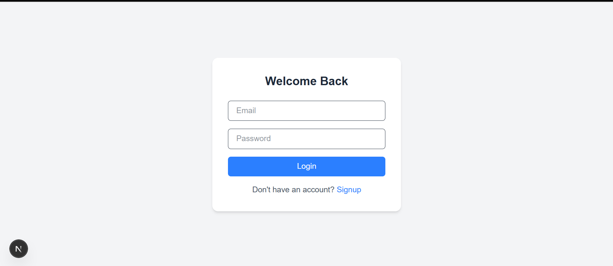
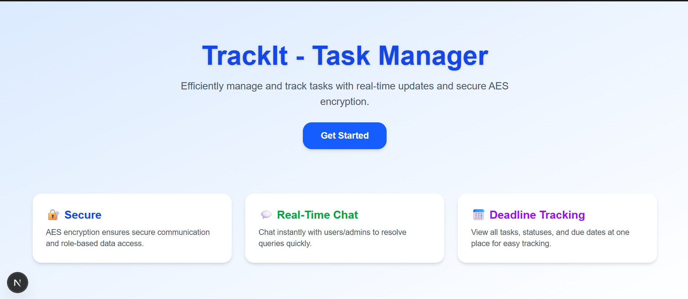
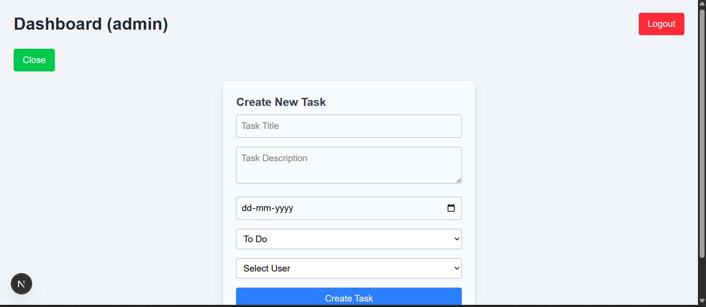
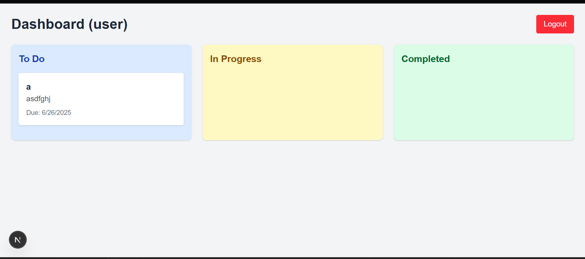
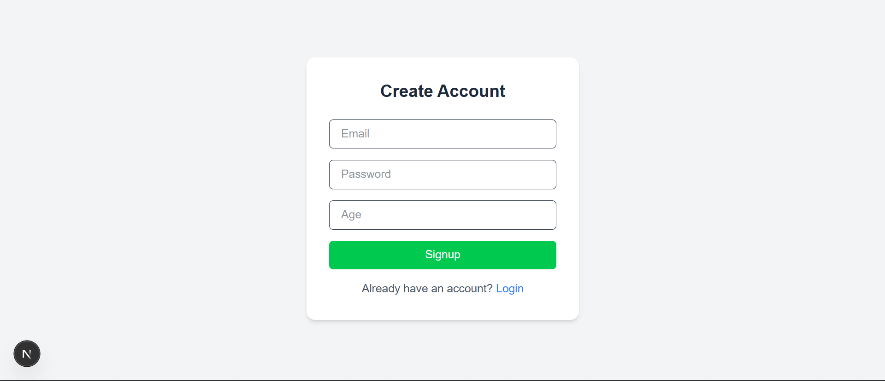

# 📌 TrackIt - Task Manager App

**TrackIt** is a secure and intuitive task management application built with **Next.js (Frontend)** and **Node.js + Express (Backend)**. It supports **admin task assignment**, **JWT authentication**, **AES-encrypted API communication**, **live chat**, and **real-time notifications**.

---

## 🚀 Features

- ✅ Secure Login & Signup with JWT  
- ✅ Role-based Access (Admin & Users)  
- ✅ AES Encrypted API Requests & Responses (CryptoJS)  
- ✅ Task Assignment & Status Tracking  
- ✅ Nodemailer Notifications on Task Update  
- ✅ Live Chat between Admin & Users  
- ✅ Modern UI with Tailwind CSS  
- ✅ MongoDB Integration with Mongoose  

---

## 📁 Tech Stack

| Frontend | Backend | Database | Security |
|----------|---------|----------|----------|
| Next.js  | Express | MongoDB  | JWT + AES |

---

## 🖼️ Screenshots

### 🔐 Login Page

### 📋 Homepage

### ✏️ Create Task

### 📋 UserPage

### 🔐 SignUp Page

## 🛠️ Setup Instructions

### 1. Clone the Repo

bash
git clone https://github.com/yourusername/trackit-task-manager.git
cd trackit-task-manager

### 2.  Backend Setup

cd trackit-backend
npm install

Create a .env file:

PORT=5000
MONGO_URI=your_mongo_connection_string
JWT_SECRET=your_jwt_secret
CRYPTO_SECRET=1234567890123456
EMAIL_USER=your_email@gmail.com
EMAIL_PASS=your_email_password

Start the backend:

npm run dev

### 3. Frontend Setup

cd ../trackit-frontend
npm install

Create a .env.local file:

NEXT_PUBLIC_CRYPTO_SECRET=1234567890123456

Start the frontend:

npm run dev

### 4.🧪Test Credentials

🔐 Admin
Email: admin@example.com
Password: admin123

👤 User
Email: user1@example.com
Password: user123

📬 Contact
Built with ❤️ by Sahil Akhtar
Have questions? Email me at: sahilakthar8986@gmail.com

